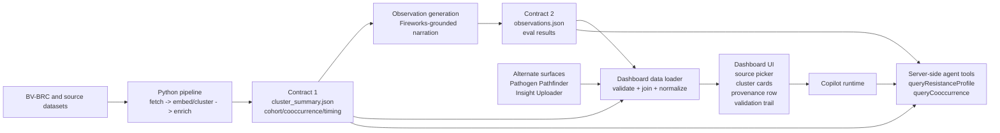

# System Design

```mermaid
flowchart LR
    A["BV-BRC and source datasets"] --> B["Python pipeline
    fetch -> embed/cluster -> enrich"]
    B --> C["Contract 1
    cluster_summary.json
    cohort/cooccurrence/timing"]
    C --> D["Observation generation
    Fireworks-grounded narration"]
    D --> E["Contract 2
    observations.json
    eval results"]

    C --> F["Dashboard data loader
    validate + join + normalize"]
    E --> F

    F --> G["Dashboard UI
    source picker
    cluster cards
    provenance row
    validation trail"]

    G --> H["Copilot runtime"]
    H --> I["Server-side agent tools
    queryResistanceProfile
    queryCooccurrence"]

    C --> I
    E --> I

    J["Alternate surfaces
    Pathogen Pathfinder
    Insight Uploader"] --> F
```
